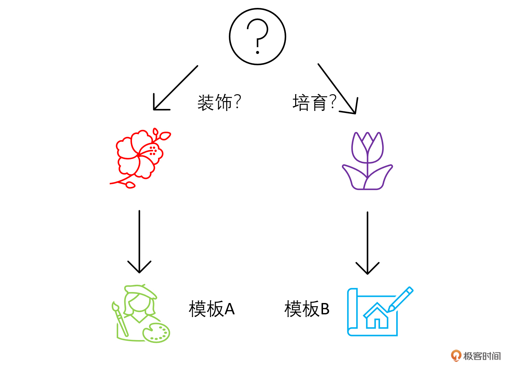
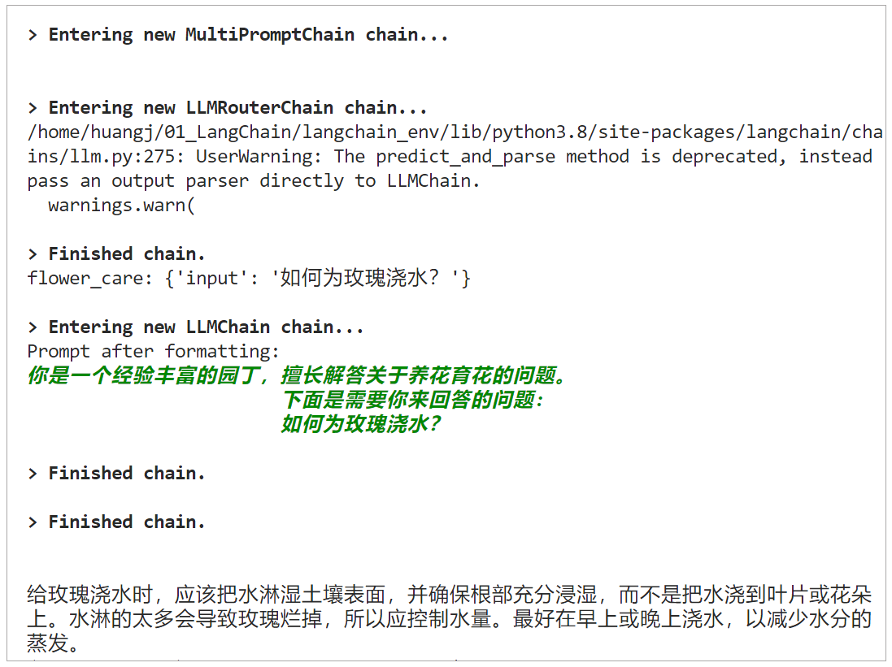
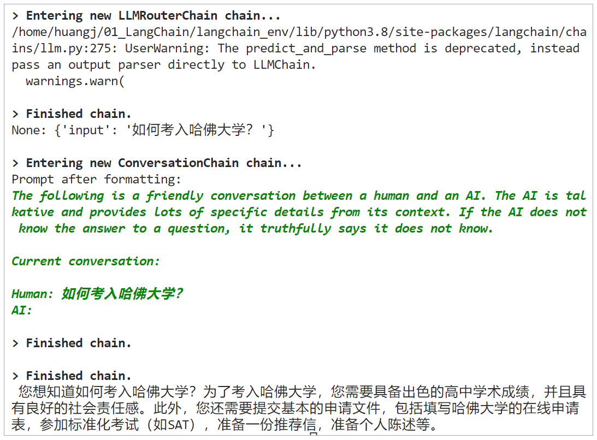

# 09｜链（下）：想学“育花”还是“插花”？用RouterChain确定客户意图
你好，我是黄佳。欢迎来到LangChain实战课！

上一节课中，我带着你学习了Chain的基本概念，还使用了LLMChain和SequencialChain，这一节课，我们再来看看其他类型的一些Chain的用法。

## 任务设定

首先，还是先看一下今天要完成一个什么样的任务。

这里假设咱们的鲜花运营智能客服ChatBot通常会接到两大类问题。

1. **鲜花养护**（保持花的健康、如何浇水、施肥等）
2. **鲜花装饰**（如何搭配花、如何装饰场地等）

你的需求是， **如果接到的是第一类问题，你要给ChatBot A指示；如果接到第二类的问题，你要给ChatBot B指示**。



我们可以根据这两个场景来构建两个不同的目标链。遇到不同类型的问题，LangChain会通过RouterChain来自动引导大语言模型选择不同的模板。

当然我们的运营过程会遇到更多种类的问题，你只需要通过同样的方法扩充逻辑即可。

## 整体框架

RouterChain，也叫路由链，能动态选择用于给定输入的下一个链。我们会根据用户的问题内容，首先使用路由器链确定问题更适合哪个处理模板，然后将问题发送到该处理模板进行回答。如果问题不适合任何已定义的处理模板，它会被发送到默认链。

在这里，我们会用LLMRouterChain和MultiPromptChain（也是一种路由链）组合实现路由功能，该MultiPromptChain会调用LLMRouterChain选择与给定问题最相关的提示，然后使用该提示回答问题。

**具体步骤如下：**

1. 构建处理模板：为鲜花护理和鲜花装饰分别定义两个字符串模板。
2. 提示信息：使用一个列表来组织和存储这两个处理模板的关键信息，如模板的键、描述和实际内容。
3. 初始化语言模型：导入并实例化语言模型。
4. 构建目标链：根据提示信息中的每个模板构建了对应的LLMChain，并存储在一个字典中。
5. 构建LLM路由链：这是决策的核心部分。首先，它根据提示信息构建了一个路由模板，然后使用这个模板创建了一个LLMRouterChain。
6. 构建默认链：如果输入不适合任何已定义的处理模板，这个默认链会被触发。
7. 构建多提示链：使用MultiPromptChain将LLM路由链、目标链和默认链组合在一起，形成一个完整的决策系统。

## 具体实现

下面，就是用路由链自动选择处理模板的具体代码实现。

### 构建提示信息的模板

首先，我们针对两种场景，构建两个提示信息的模板。

```plain
# 构建两个场景的模板
flower_care_template = """你是一个经验丰富的园丁，擅长解答关于养花育花的问题。
                        下面是需要你来回答的问题:
                        {input}"""

flower_deco_template = """你是一位网红插花大师，擅长解答关于鲜花装饰的问题。
                        下面是需要你来回答的问题:
                        {input}"""

# 构建提示信息
prompt_infos = [
    {
        "key": "flower_care",
        "description": "适合回答关于鲜花护理的问题",
        "template": flower_care_template,
    },
    {
        "key": "flower_decoration",
        "description": "适合回答关于鲜花装饰的问题",
        "template": flower_deco_template,
    }]

```

### 初始化语言模型

接下来，我们初始化语言模型。

```plain
# 初始化语言模型
from langchain.llms import OpenAI
import os
os.environ["OPENAI_API_KEY"] = '你的OpenAI Key'
llm = OpenAI()

```

### 构建目标链

下面，我们循环prompt\_infos这个列表，构建出两个目标链，分别负责处理不同的问题。

```plain
# 构建目标链
from langchain.chains.llm import LLMChain
from langchain.prompts import PromptTemplate
chain_map = {}
for info in prompt_infos:
    prompt = PromptTemplate(template=info['template'],
                            input_variables=["input"])
    print("目标提示:\n",prompt)
    chain = LLMChain(llm=llm, prompt=prompt,verbose=True)
    chain_map[info["key"]] = chain

```

这里，目标链提示是这样的：

```plain
目标提示:
input_variables=['input']
output_parser=None partial_variables={}
template='你是一个经验丰富的园丁，擅长解答关于养花育花的问题。\n                        下面是需要你来回答的问题:\n
{input}' template_format='f-string'
validate_template=True

目标提示:
input_variables=['input']
output_parser=None partial_variables={}
template='你是一位网红插花大师，擅长解答关于鲜花装饰的问题。\n                        下面是需要你来回答的问题:\n
{input}' template_format='f-string'
validate_template=True

```

对于每个场景，我们创建一个 LLMChain（语言模型链）。每个链会根据其场景模板生成对应的提示，然后将这个提示送入语言模型获取答案。

### 构建路由链

下面，我们构建路由链，负责查看用户输入的问题，确定问题的类型。

```plain
# 构建路由链
from langchain.chains.router.llm_router import LLMRouterChain, RouterOutputParser
from langchain.chains.router.multi_prompt_prompt import MULTI_PROMPT_ROUTER_TEMPLATE as RounterTemplate
destinations = [f"{p['key']}: {p['description']}" for p in prompt_infos]
router_template = RounterTemplate.format(destinations="\n".join(destinations))
print("路由模板:\n",router_template)
router_prompt = PromptTemplate(
    template=router_template,
    input_variables=["input"],
    output_parser=RouterOutputParser(),)
print("路由提示:\n",router_prompt)
router_chain = LLMRouterChain.from_llm(llm,
                                       router_prompt,
                                       verbose=True)

```

输出：

````
路由模板:
 Given a raw text input to a language model select the model prompt best suited for the input. You will be given the names of the available prompts and a description of what the prompt is best suited for. You may also revise the original input if you think that revising it will ultimately lead to a better response from the language model.

<< FORMATTING >>
Return a markdown code snippet with a JSON object formatted to look like:
```json
{{
    "destination": string \ name of the prompt to use or "DEFAULT"
    "next_inputs": string \ a potentially modified version of the original input
}}
```

REMEMBER: "destination" MUST be one of the candidate prompt names specified below OR it can be "DEFAULT" if the input is not well suited for any of the candidate prompts.
REMEMBER: "next_inputs" can just be the original input if you don't think any modifications are needed.

<< CANDIDATE PROMPTS >>
flower_care: 适合回答关于鲜花护理的问题
flower_decoration: 适合回答关于鲜花装饰的问题

<< INPUT >>
{input}

<< OUTPUT >>

路由提示:
input_variables=['input'] output_parser=RouterOutputParser(default_destination='DEFAULT', next_inputs_type=<class 'str'>, next_inputs_inner_key='input')
partial_variables={}
template='Given a raw text input to a language model select the model prompt best suited for the input. You will be given the names of the available prompts and a description of what the prompt is best suited for. You may also revise the original input if you think that revising it will ultimately lead to a better response from the language model.\n\n
<< FORMATTING >>\n
Return a markdown code snippet with a JSON object formatted to look like:\n```json\n{{\n "destination": string \\ name of the prompt to use or "DEFAULT"\n    "next_inputs": string \\ a potentially modified version of the original input\n}}\n```\n\n
REMEMBER: "destination" MUST be one of the candidate prompt names specified below OR it can be "DEFAULT" if the input is not well suited for any of the candidate prompts.\n
REMEMBER: "next_inputs" can just be the original input if you don\'t think any modifications are needed.\n\n<< CANDIDATE PROMPTS >>\n
flower_care: 适合回答关于鲜花护理的问题\n
flower_decoration: 适合回答关于鲜花装饰的问题\n\n
<< INPUT >>\n{input}\n\n<< OUTPUT >>\n'
template_format='f-string'
validate_template=True

````

这里我说一下路由器链是如何构造提示信息，来引导大模型查看用户输入的问题并确定问题的类型的。

先看路由模板部分，这段模板字符串是一个指导性的说明，目的是引导语言模型正确处理用户的输入，并将其定向到适当的模型提示。

**1\. 路由模板的解释**

路由模板是路由功能得以实现的核心。我们来详细分解一下这个模板的每个部分。

**引言**

> Given a raw text input to a language model select the model prompt best suited for the input.

这是一个简单的引导语句，告诉模型你将给它一个输入，它需要根据这个输入选择最适合的模型提示。

> You will be given the names of the available prompts and a description of what the prompt is best suited for.

这里进一步提醒模型，它将获得各种模型提示的名称和描述。

> You may also revise the original input if you think that revising it will ultimately lead to a better response from the language model.

这是一个可选的步骤，告诉模型它可以更改原始输入以获得更好的响应。

**格式说明(<< FORMATTING >>)**

指导模型如何格式化其输出，使其以特定的方式返回结果。

> Return a markdown code snippet with a JSON object formatted to look like:

表示模型的输出应该是一个 Markdown 代码片段，其中包含一个特定格式的 JSON 对象。

下面的代码块显示了期望的 JSON 结构，其中 destination 是模型选择的提示名称（或“DEFAULT”），而 next\_inputs 是可能被修订的原始输入。

**额外的说明和要求**

> REMEMBER: “destination” MUST be one of the candidate prompt names specified below OR it can be “DEFAULT”…

这是一个重要的指导，提醒模型 “destination” 字段的值必须是下面列出的提示之一或是 “DEFAULT”。

> REMEMBER: “next\_inputs” can just be the original input if you don’t think any modifications are needed.

这再次强调，除非模型认为有必要，否则原始输入不需要修改。

**候选提示(<< CANDIDATE PROMPTS >>)**

列出了两个示例模型提示及其描述：

- “flower\_care: 适合回答关于鲜花护理的问题”，适合处理与花卉护理相关的问题。
- “flower\_decoration: 适合回答关于鲜花装饰的问题”，适合处理与花卉装饰相关的问题。

**输入/输出部分**

> << INPUT >>\\n{input}\\n\\n<< OUTPUT >>\\n：

这部分为模型提供了一个格式化的框架，其中它将接收一个名为 {input} 的输入，并在此后的部分输出结果。

总的来说，这个模板的目的是让模型知道如何处理用户的输入，并根据提供的提示列表选择一个最佳的模型提示来回应。

**2\. 路由提示的解释**

路由提示 (router\_prompt）则根据路由模板，生成了具体传递给LLM的路由提示信息。

- 其中input\_variables 指定模板接收的输入变量名，这里只有 `"input"`。
- output\_parser 是一个用于解析模型输出的对象，它有一个默认的目的地和一个指向下一输入的键。
- template 是实际的路由模板，用于给模型提供指示。这就是刚才详细解释的模板内容。
- template\_format 指定模板的格式，这里是 `"f-string"`。
- validate\_template 是一个布尔值，如果为 True，则会在使用模板前验证其有效性。

简而言之，这个构造允许你将用户的原始输入送入路由器，然后路由器会决定将该输入发送到哪个具体的模型提示，或者是否需要对输入进行修订以获得最佳的响应。

### 构建默认链

除了处理目标链和路由链之外，我们还需要准备一个默认链。如果路由链没有找到适合的链，那么，就以默认链进行处理。

```plain
# 构建默认链
from langchain.chains import ConversationChain
default_chain = ConversationChain(llm=llm,
                                  output_key="text",
                                  verbose=True)

```

### 构建多提示链

最后，我们使用MultiPromptChain类把前几个链整合在一起，实现路由功能。这个MultiPromptChain类是一个多路选择链，它使用一个LLM路由器链在多个提示之间进行选择。

**MultiPromptChain中有三个关键元素。**

- router\_chain（类型RouterChain）：这是用于决定目标链和其输入的链。当给定某个输入时，这个router\_chain决定哪一个destination\_chain应该被选中，以及传给它的具体输入是什么。
- destination\_chains（类型Mapping\[str, LLMChain\]）：这是一个映射，将名称映射到可以将输入路由到的候选链。例如，你可能有多种处理文本输入的方法（或“链”），每种方法针对特定类型的问题。destination\_chains可以是这样一个字典： `{'weather': weather_chain, 'news': news_chain}`。在这里，weather\_chain可能专门处理与天气相关的问题，而news\_chain处理与新闻相关的问题。
- default\_chain（类型LLMChain）：当 router\_chain 无法将输入映射到destination\_chains中的任何一个链时，LLMChain 将使用此默认链。这是一个备选方案，确保即使路由器不能决定正确的链，也总有一个链可以处理输入。

**它的工作流程如下：**

1. 输入首先传递给router\_chain。
2. router\_chain根据某些标准或逻辑决定应该使用哪一个destination\_chain。
3. 输入随后被路由到选定的destination\_chain，该链进行处理并返回结果。
4. 如果router\_chain不能决定正确的destination\_chain，则输入会被传递给default\_chain。

这样，MultiPromptChain就为我们提供了一个在多个处理链之间动态路由输入的机制，以得到最相关或最优的输出。

实现代码如下：

```plain
# 构建多提示链
from langchain.chains.router import MultiPromptChain
chain = MultiPromptChain(
    router_chain=router_chain,
    destination_chains=chain_map,
    default_chain=default_chain,
    verbose=True)

```

## 运行路由链

好了，至此我们的链路已经准备好了。现在开始提出各种问题，测试一下我们的链。

**测试A：**

print(chain.run(“如何为玫瑰浇水？”))

输出：



**测试B：**

print(chain.run(“如何为婚礼场地装饰花朵？”))

输出：


**测试C：**

print(chain.run(“如何考入哈佛大学？”))

输出：



这三个测试，分别被路由到了三个不同的目标链，其中两个是我们预设的“专家类型”目标链，而第三个问题：如何考入哈佛大学？被模型一眼看穿，并不属于任何鲜花运营业务场景，路由链把它抛入了一个 “default chain” —— ConversationChain 去解决。

## 总结时刻

在这个示例中，我们看到了LLMRouterChain以及MultiPromptChain。其中，LLMRouterChain继承自RouterChain；而MultiPromptChain则继承自MultiRouteChain。

整体上，我们通过MultiPromptChain把其他链组织起来，完成了路由功能。

```plain
chain = MultiPromptChain(
    router_chain=router_chain,
    destination_chains=chain_map,
    default_chain=default_chain,
    verbose=True)

```

在LangChain的 chains -> router -> base.py 文件中，可以看到RouterChain和MultiRouteChain的代码实现。

## 思考题

1. 通过verbose=True这个选项的设定，在输出时显示了链的开始和结束日志，从而得到其相互调用流程。请你尝试把该选项设置为False，看一看输出结果有何不同。
2. 在这个例子中，我们使用了ConversationChain作为default\_chain，这个Chain是LLMChain的子类，你能否把这个Chain替换为LLMChain？

期待在留言区看到你的分享。如果你觉得内容对你有帮助，也欢迎分享给有需要的朋友！最后如果你学有余力，可以进一步学习下面的延伸阅读。

## 延伸阅读

1. 代码，RouterChain和MultiRouteChain的 [实现细节](https://github.com/langchain-ai/langchain/blob/master/libs/langchain/langchain/chains/router/base.py)
2. 代码，MultiPromptChain的 [实现细节](https://github.com/langchain-ai/langchain/blob/master/libs/langchain/langchain/chains/router/multi_prompt.py)