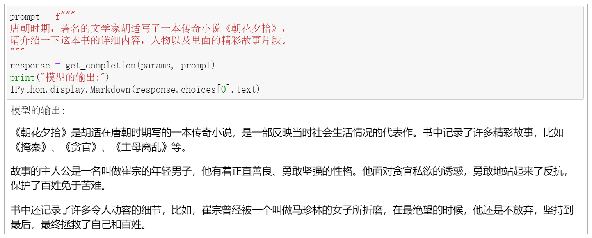
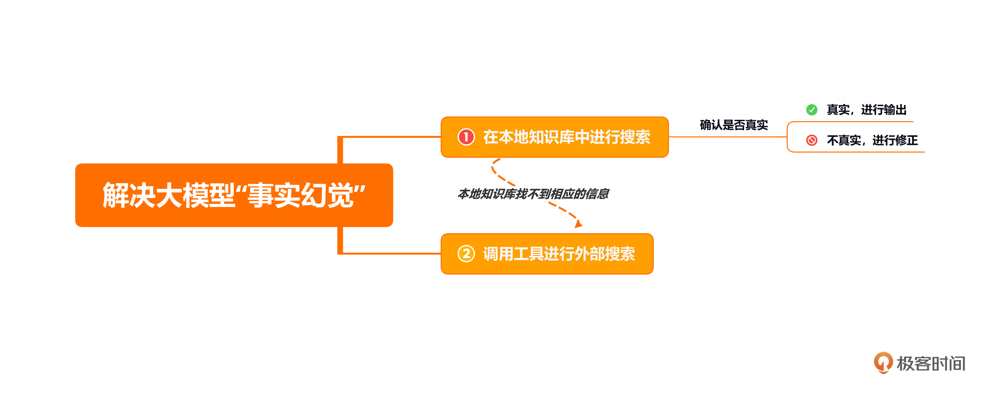
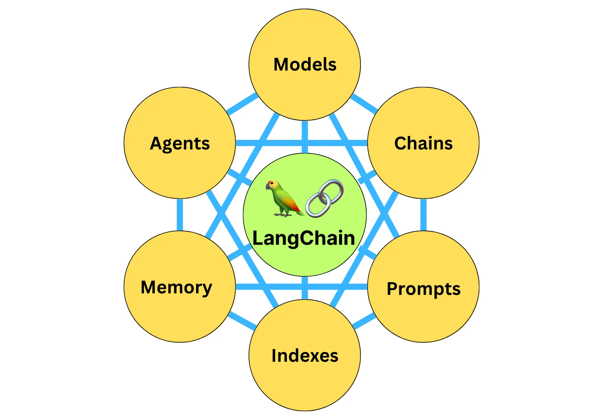
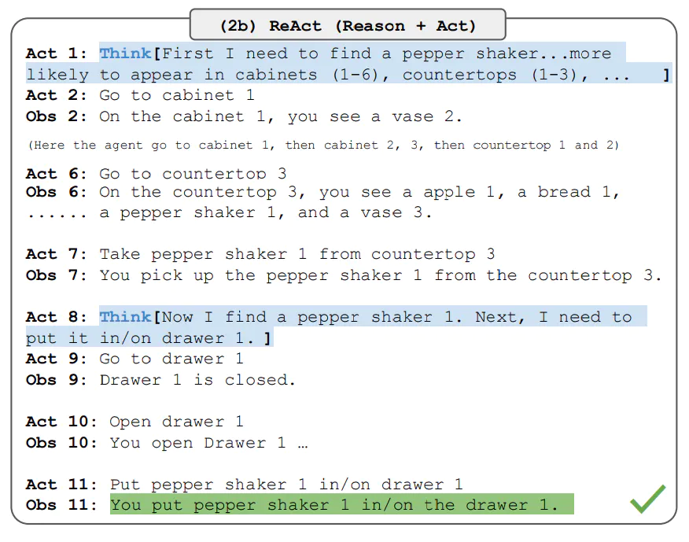
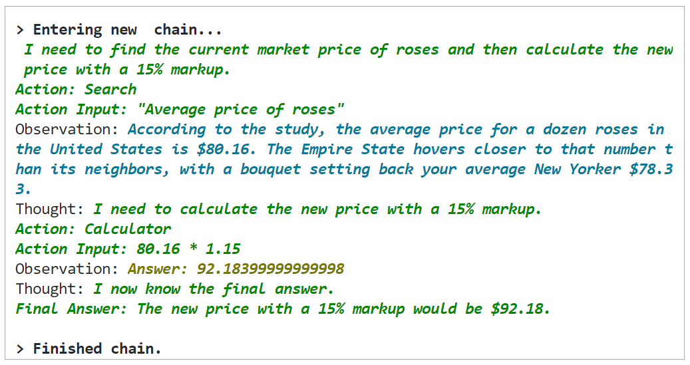
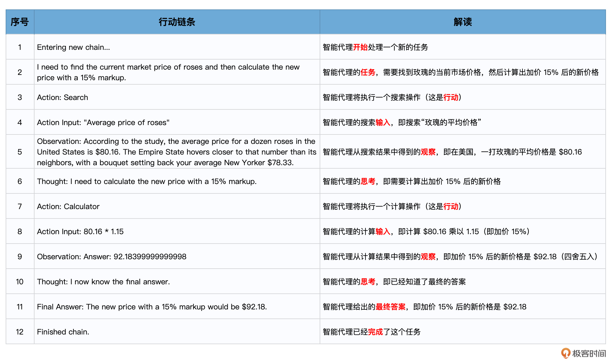

# 11｜代理（上）：ReAct框架，推理与行动的协同
你好，我是黄佳，欢迎来到LangChain实战课！

在之前介绍的思维链（CoT）中，我向你展示了 LLMs 执行推理轨迹的能力。在给出答案之前，大模型通过中间推理步骤（尤其是与少样本提示相结合）能够实现复杂的推理，获得更好的结果，以完成更具挑战的任务。

然而，仅仅应用思维链推理并不能解决大模型的固有问题： **无法主动更新自己的知识，导致出现事实幻觉**。也就是说，因为缺乏和外部世界的接触，大模型只拥有训练时见过的知识，以及提示信息中作为上下文提供的附加知识。如果你问的问题超出它的知识范围，要么大模型向你坦白：“我的训练时间截至XXXX年XX月XX日”，要么它就会开始一本正经地胡说。

下面这张图就属于第二种情况，我制作的一个Prompt骗过了大模型，它会误以为我引述的很多虚构的东西是事实，而且它还会顺着这个思路继续胡编乱造。



这个问题如何解决呢？

也不难。你可以让大模型先在本地知识库中进行搜索，检查一下提示中的信息的真实性，如果真实，再进行输出；如果不真实，则进行修正。如果本地知识库找不到相应的信息，可以调用工具进行外部搜索，来检查提示信息的真实性。



上面所说的无论本地知识库还是搜索引擎，都不是封装在大模型内部的知识，我们把它们称为“外部工具”。

## 代理的作用

每当你遇到这种需要模型做自主判断、自行调用工具、自行决定下一步行动的时候，Agent（也就是代理）就出场了。



代理就像一个多功能的接口，它能够接触并使用一套工具。根据用户的输入，代理会决定调用哪些工具。它不仅可以同时使用多种工具，而且可以将一个工具的输出数据作为另一个工具的输入数据。

在LangChain中使用代理，我们只需要理解下面三个元素。

- **大模型**：提供逻辑的引擎，负责生成预测和处理输入。
- 与之交互的 **外部工具**：可能包括数据清洗工具、搜索引擎、应用程序等。
- 控制交互的 **代理**：调用适当的外部工具，并管理整个交互过程的流程。


上面的思路看似简单，其实很值得我们仔细琢磨。

这个过程有很多地方需要大模型自主判断下一步行为（也就是操作）要做什么，如果不加引导，那大模型本身是不具备这个能力的。比如下面这一系列的操作：

- 什么时候开始在本地知识库中搜索（这个比较简单，毕竟是第一个步骤，可以预设）？
- 怎么确定本地知识库的检索已经完成，可以开始下一步？
- 调用哪一种外部搜索工具（比如Google引擎）？
- 如何确定外部搜索工具返回了想要找的内容？
- 如何确定信息真实性的检索已经全部完成，可以开始下一步？

那么，LangChain中的代理是怎样自主计划、自行判断，并执行行动的呢？

## ReAct框架

这里我要请你思考一下：如果你接到一个新任务，你将如何做出决策并完成下一步的行动？

比如说，你在运营花店的过程中，经常会经历天气变化而导致的鲜花售价变化，那么，每天早上你会如何为你的鲜花定价？

也许你会告诉我，我会去Google上面查一查今天的鲜花成本价啊（ **行动**），也就是我预计的进货的价格，然后我会根据这个价格的高低（ **观察**），来确定我要加价多少（ **思考**），最后计算出一个售价（ **行动**）！


你看，在这个简单的例子中，你有观察、有思考，然后才会具体行动。这里的观察和思考，我们统称为推理（Reasoning）过程，推理指导着你的行动（Acting）。

我们今天要讲的 **ReAct 框架的灵感正是来自“行动”和“推理”之间的协同作用，这种协同作用使得咱们人类能够学习新任务并做出决策或推理**。这个框架，也是大模型能够作为“智能代理”，自主、连续、交错地生成推理轨迹和任务特定操作的理论基础。

先和你说明一点，此 ReAct 并非指代流行的前端开发框架React，它在这里专指如何指导大语言模型推理和行动的一种思维框架。这个思维框架是Shunyu Yao等人在ICLR 2023会议论文《 [ReAct: Synergizing Reasoning and Acting in Language Models](https://arxiv.org/pdf/2210.03629.pdf)》（ReAct：在语言模型中协同推理和行动）中提出的。

这篇文章的一个关键启发在于： **大语言模型可以通过生成推理痕迹和任务特定行动来实现更大的协同作用**。

具体来说，就是引导模型生成一个任务解决轨迹：观察环境-进行思考-采取行动，也就是观察-思考-行动。那么，再进一步进行简化，就变成了推理-行动，也就是Reasoning-Acting框架。

其中，Reasoning包括了对当前环境和状态的观察，并生成推理轨迹。这使模型能够诱导、跟踪和更新操作计划，甚至处理异常情况。Acting在于指导大模型采取下一步的行动，比如与外部源（如知识库或环境）进行交互并且收集信息，或者给出最终答案。

ReAct的每一个推理过程都会被详细记录在案，这也改善大模型解决问题时的可解释性和可信度，而且这个框架在各种语言和决策任务中都得到了很好的效果。

下面让我们用一个具体的示例来说明这一点。比如我给出大模型这样一个任务：在一个虚拟环境中找到一个胡椒瓶并将其放在一个抽屉里。

在这个任务中，没有推理能力的模型不能够在房间的各个角落中进行寻找，或者在找到胡椒瓶之后不能够判断下一步的行动，因而无法完成任务。如果使用ReAct，这一系列子目标将被具体地捕获在每一个思考过程中。



现在，让我们回到开始的时候我们所面临的问题。仅仅使用思维链（CoT）提示，LLMs能够执行推理轨迹，以完成算术和常识推理等问题，但这样的模型因为缺乏和外部世界的接触或无法更新自己的知识，会导致幻觉的出现。


而将 ReAct框架和思维链（CoT）结合使用，则能够让大模型在推理过程同时使用内部知识和获取到的外部信息，从而给出更可靠和实际的回应，也提高了 LLMs 的可解释性和可信度。

LangChain正是通过Agent类，将ReAct框架进行了完美封装和实现，这一下子就赋予了大模型极大的自主性（Autonomy）， **你的大模型现在从一个仅仅可以通过自己内部知识进行对话聊天的** **Bot** **，** **飞升为了一个有手有脚能使用工具的智能代理**。

ReAct框架会提示 LLMs 为任务生成推理轨迹和操作，这使得代理能系统地执行动态推理来创建、维护和调整操作计划，同时还支持与外部环境（例如Google搜索、Wikipedia）的交互，以将额外信息合并到推理中。

## 通过代理实现ReAct框架

下面，就让我们用LangChain中最为常用的 **ZERO\_SHOT\_REACT\_DESCRIPTION** ——这种常用代理类型，来剖析一下LLM是如何在ReAct框架的指导之下进行推理的。

此处，我们要给代理一个任务，这个任务是找到玫瑰的当前市场价格，然后计算出加价15%后的新价格。

在开始之前，有一个准备工作，就是你需要在 [serpapi.com](https://serpapi.com/) 注册一个账号，并且拿到你的 SERPAPI\_API\_KEY，这个就是我们要为大模型提供的 Google 搜索工具。


先安装SerpAPI的包。

```
pip install google-search-results

```

设置好OpenAI和SerpAPI的API密钥。

```
# 设置OpenAI和SERPAPI的API密钥
import os
os.environ["OPENAI_API_KEY"] = 'Your OpenAI API Key'
os.environ["SERPAPI_API_KEY"] = 'Your SerpAPI API Key'

```

再导入所需的库。

```plain
from langchain.agents import load_tools
from langchain.agents import initialize_agent
from langchain.agents import AgentType
from langchain.llms import OpenAI

```

然后加载将用于控制代理的语言模型。

```plain
llm = OpenAI(temperature=0)

```

接下来，加载一些要使用的工具，包括serpapi（这是调用Google搜索引擎的工具）以及llm-math（这是通过LLM进行数学计算的工具）。

```plain
tools = load_tools(["serpapi", "llm-math"], llm=llm)

```

最后，让我们使用工具、语言模型和代理类型来初始化代理。

```plain
agent = initialize_agent(tools, llm, agent=AgentType.ZERO_SHOT_REACT_DESCRIPTION, verbose=True)

```

好了，现在我们让代理来回答我刚才提出的问题了！目前市场上玫瑰花的平均价格是多少？如果我在此基础上加价15%卖出，应该如何定价？

```plain
agent.run("目前市场上玫瑰花的平均价格是多少？如果我在此基础上加价15%卖出，应该如何定价？")

```

大模型成功遵循了ReAct框架，它输出的思考与行动轨迹如下：

```plain
> Entering new  chain...
 I need to find the current market price of roses and then calculate the new price with a 15% markup.
Action: Search
Action Input: "Average price of roses"
Observation: According to the study, the average price for a dozen roses in the United States is $80.16. The Empire State hovers closer to that number than its neighbors, with a bouquet setting back your average New Yorker $78.33.
Thought: I need to calculate the new price with a 15% markup.
Action: Calculator
Action Input: 80.16 * 1.15
Observation: Answer: 92.18399999999998
Thought: I now know the final answer.
Final Answer: The new price with a 15% markup would be $92.18.
> Finished chain.

```



可以看到，ZERO\_SHOT\_REACT\_DESCRIPTION类型的智能代理在LangChain中，自动形成了一个完善的思考与行动链条，而且给出了正确的答案。

你可以对照下面这个表格，再巩固一下这个链条中的每一个环节。



这个思维链条中，智能代理有思考、有观察、有行动，成功通过搜索和计算两个操作，完成了任务。在下一讲中，我们将继续深入剖析LangChain中的不同类型的代理，并利用它完成更为复杂的任务。

## 总结时刻

这节课我们介绍了什么是LangChain中的代理，更重要的是，我们介绍了代理自主行动的驱动力—— ReAct框架。

通过ReAct框架，大模型将被引导生成一个任务解决轨迹，即观察环境-进行思考-采取行动。观察和思考阶段被统称为推理（Reasoning），而实施下一步行动的阶段被称为行动（Acting）。在每一步推理过程中，都会详细记录下来，这也改善了大模型解决问题时的可解释性和可信度。

- 在推理阶段，模型对当前环境和状态进行观察，并生成推理轨迹，从而使模型能够诱导、跟踪和更新操作计划，甚至处理异常情况。
- 在行动阶段，模型会采取下一步的行动，如与外部源（如知识库或环境）进行交互并收集信息，或给出最终答案。

ReAct框架的这些优点，使得它在未来的发展中具有巨大的潜力。随着技术的进步，我们可以期待ReAct框架将能够处理更多、更复杂的任务。特别是随着具身智能的发展，ReAct框架将能够使智能代理在虚拟或实际环境中进行更复杂的交互。例如，智能代理可能会在虚拟环境中进行导航，或者在实际环境中操作物理对象。这将大大扩展AI的应用范围，使得它们能够更好地服务于我们的生活和工作。

## 思考题

1. 在ReAct框架中，推理和行动各自代表什么？其相互之间的关系如何？
2. 为什么说ReAct框架能改善大模型解决问题时的可解释性和可信度？
3. 你能否说一说LangChain中的代理和链的核心差异？

期待在留言区看到你的思考，如果你觉得内容对你有帮助，也欢迎分享给有需要的朋友！最后如果你学有余力，可以进一步学习下面延伸阅读的两篇论文。

## 延伸阅读

1. 论文， [ReAct：在语言模型中协同推理和行动](https://arxiv.org/abs/2210.03629)，Yao, S., Zhao, J., Yu, D., Du, N., Shafran, I., Narasimhan, K., & Cao, Y. (2023). ReAct: Synergizing Reasoning and Acting in Language Models. arXiv preprint arXiv:2210.03629
2. 论文， [ART：大型语言模型的自动多步推理和工具使用](https://arxiv.org/abs/2303.09014)， Paranjape, B., Lundberg, S., Singh, S., Hajishirzi, H., Zettlemoyer, L., & Ribeiro, M. T. (2023). ART: Automatic multi-step reasoning and tool-use for large language models. arXiv preprint arXiv:2303.09014.