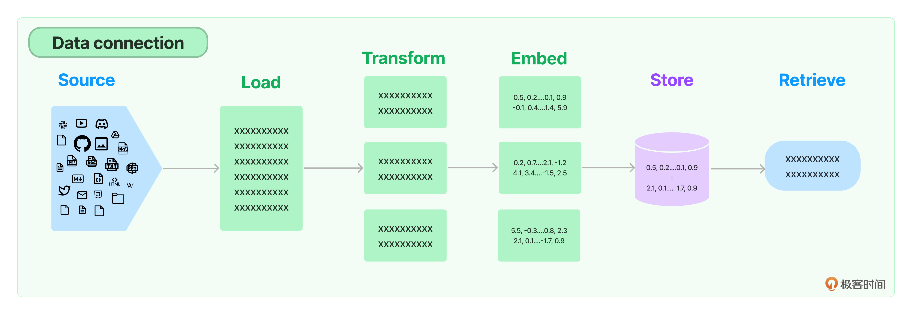
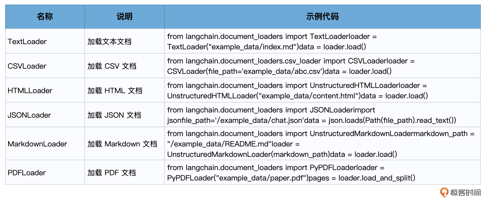
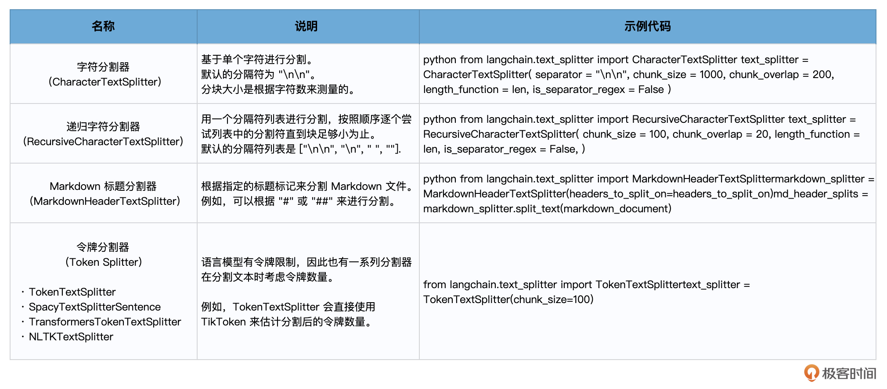
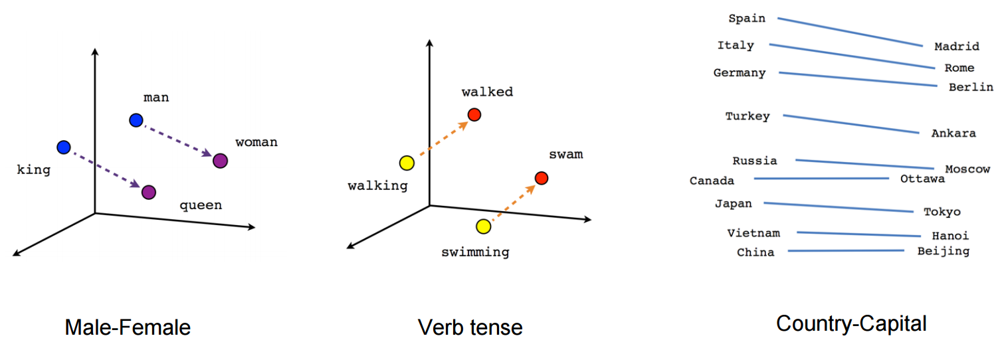
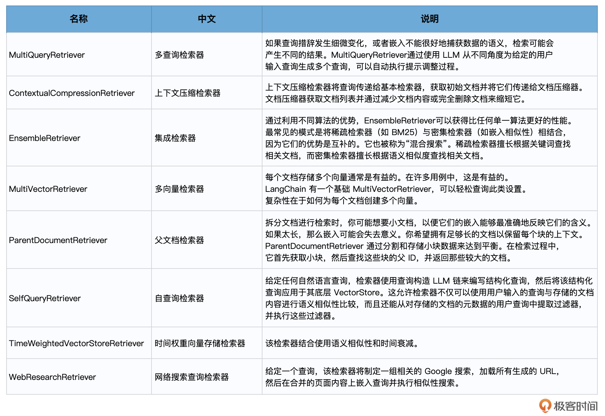
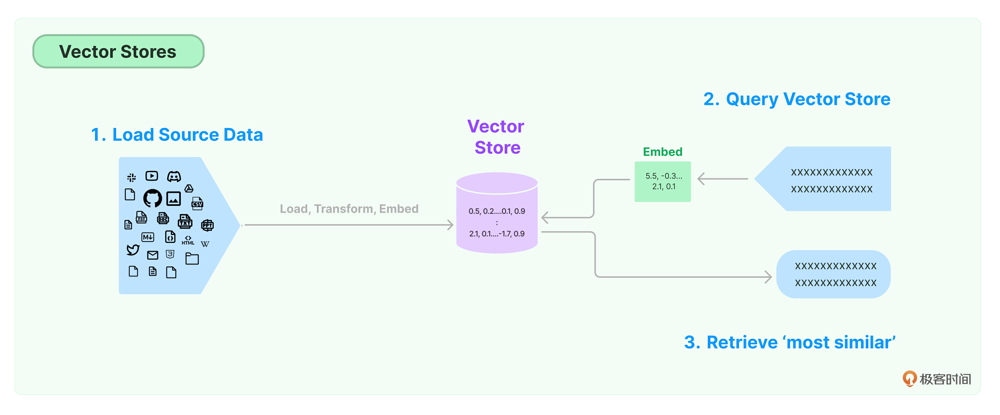

# 15｜检索增强生成：通过RAG助力鲜花运营
你好，我是黄佳，欢迎来到LangChain实战课！

在 [第2课](https://time.geekbang.org/column/article/699436) 中，我曾经带着你完成了一个基于本地文档的问答系统。用当下时髦的话说，你实现了一个RAG 应用。

什么是RAG？其全称为Retrieval-Augmented Generation，即检索增强生成，它结合了检索和生成的能力，为文本序列生成任务引入外部知识。RAG将传统的语言生成模型与大规模的外部知识库相结合，使模型在生成响应或文本时可以动态地从这些知识库中检索相关信息。这种结合方法旨在增强模型的生成能力，使其能够产生更为丰富、准确和有根据的内容，特别是在需要具体细节或外部事实支持的场合。

RAG 的工作原理可以概括为几个步骤。

1. **检索** **：** 对于给定的输入（问题），模型首先使用检索系统从大型文档集合中查找相关的文档或段落。这个检索系统通常基于密集向量搜索，例如ChromaDB、Faiss这样的向量数据库。
2. **上下文编码** **：** 找到相关的文档或段落后，模型将它们与原始输入（问题）一起编码。
3. **生成** **：** 使用编码的上下文信息，模型生成输出（答案）。这通常当然是通过大模型完成的。

RAG 的一个关键特点是，它不仅仅依赖于训练数据中的信息，还可以从大型外部知识库中检索信息。这使得RAG模型特别适合处理在训练数据中未出现的问题。



RAG类的任务，目前企业实际应用场景中的需求量相当大，也是LangChain所关注的一个重点内容。在这节课中，我会对LangChain中所有与之相关的工具进行一个梳理，便于你把握LangChain在这个领域中都能够做到些什么。

## 文档加载

RAG的第一步是文档加载。LangChain 提供了多种类型的文档加载器，以加载各种类型的文档（HTML、PDF、代码），并与该领域的其他主要提供商如 Airbyte 和 Unstructured.IO 进行了集成。

下面给出常用的文档加载器列表。



## 文本转换

加载文档后，下一个步骤是对文本进行转换，而最常见的文本转换就是把长文档分割成更小的块（或者是片，或者是节点），以适合模型的上下文窗口。LangChain 有许多内置的文档转换器，可以轻松地拆分、组合、过滤和以其他方式操作文档。

### 文本分割器

把长文本分割成块听起来很简单，其实也存在一些细节。文本分割的质量会影响检索的结果质量。理想情况下，我们希望将语义相关的文本片段保留在一起。

LangChain中，文本分割器的工作原理如下：

1. 将文本分成小的、具有语义意义的块（通常是句子）。
2. 开始将这些小块组合成一个更大的块，直到达到一定的大小。
3. 一旦达到该大小，一个块就形成了，可以开始创建新文本块。这个新文本块和刚刚生成的块要有一些重叠，以保持块之间的上下文。

因此，LangChain提供的各种文本拆分器可以帮助你从下面几个角度设定你的分割策略和参数：

1. 文本如何分割
2. 块的大小
3. 块之间重叠文本的长度

这些文本分割器的说明和示例如下：



你可能会关心，文本分割在实践，有哪些具体的考量因素，我总结了下面几点。

**首先，就是LLM 的具体限制。** GPT-3.5-turbo支持的上下文窗口为4096个令牌，这意味着输入令牌和生成的输出令牌的总和不能超过4096，否则会出错。为了保证不超过这个限制，我们可以预留约2000个令牌作为输入提示，留下约2000个令牌作为返回的消息。这样，如果你提取出了五个相关信息块，那么每个片的大小不应超过400个令牌。

**此外，文本分割策略的选择和任务类型相关。**

- 需要细致查看文本的任务，最好使用较小的分块。例如，拼写检查、语法检查和文本分析可能需要识别文本中的单个单词或字符。垃圾邮件识别、查找剽窃和情感分析类任务，以及搜索引擎优化、主题建模中常用的关键字提取任务也属于这类细致任务。
- 需要全面了解文本的任务，则使用较大的分块。例如，机器翻译、文本摘要和问答任务需要理解文本的整体含义。而自然语言推理、问答和机器翻译需要识别文本中不同部分之间的关系。还有创意写作，都属于这种粗放型的任务。

**最后，你也要考虑所分割的文本的性质。** 例如，如果文本结构很强，如代码或HTML，你可能想使用较大的块，如果文本结构较弱，如小说或新闻文章，你可能想使用较小的块。

你可以反复试验不同大小的块和块与块之间重叠窗口的大小，找到最适合你特定问题的解决方案。

### 其他形式的文本转换

除拆分文本之外，LangChain中还集成了各种工具对文档执行的其他类型的转换。下面让我们对其进行逐点分析。

1. 过滤冗余的文档：使用 EmbeddingsRedundantFilter 工具可以识别相似的文档并过滤掉冗余信息。这意味着如果你有多份高度相似或几乎相同的文档，这个功能可以帮助识别并删除这些多余的副本，从而节省存储空间并提高检索效率。
2. 翻译文档：通过与工具 doctran 进行集成，可以将文档从一种语言翻译成另一种语言。
3. 提取元数据：通过与工具 doctran 进行集成，可以从文档内容中提取关键信息（如日期、作者、关键字等），并将其存储为元数据。元数据是描述文档属性或内容的数据，这有助于更有效地管理、分类和检索文档。
4. 转换对话格式：通过与工具 doctran 进行集成，可以将对话式的文档内容转化为问答（Q/A）格式，从而更容易地提取和查询特定的信息或回答。这在处理如访谈、对话或其他交互式内容时非常有用。

所以说，文档转换不仅限于简单的文本拆分，还可以包含附加的操作，这些操作的目的都是更好地准备和优化文档，以供后续生成更好的索引和检索功能。

## 文本嵌入

文本块形成之后，我们就通过LLM来做嵌入（Embeddings），将文本转换为数值表示，使得计算机可以更容易地处理和比较文本。OpenAI、Cohere、Hugging Face 中都有能做文本嵌入的模型。

Embeddings 会创建一段文本的向量表示，让我们可以在向量空间中思考文本，并执行语义搜索之类的操作，在向量空间中查找最相似的文本片段。



LangChain中的Embeddings 类是设计用于与文本嵌入模型交互的类。这个类为所有这些提供者提供标准接口。

```plain
# 初始化Embedding类
from langchain.embeddings import OpenAIEmbeddings
embeddings_model = OpenAIEmbeddings()

```

它提供两种方法：

1. 第一种是 embed\_documents 方法，为文档创建嵌入。这个方法接收多个文本作为输入，意味着你可以一次性将多个文档转换为它们的向量表示。
2. 第二种是 embed\_query 方法，为查询创建嵌入。这个方法只接收一个文本作为输入，通常是用户的搜索查询。

**为** **什么需要两种方法？** 虽然看起来这两种方法都是为了文本嵌入，但是LangChain将它们分开了。原因是一些嵌入提供者对于文档和查询使用的是不同的嵌入方法。文档是要被搜索的内容，而查询是实际的搜索请求。这两者可能因为其性质和目的，而需要不同的处理或优化。

embed\_documents 方法的示例代码如下：

```plain
embeddings = embeddings_model.embed_documents(
    [
        "您好，有什么需要帮忙的吗？",
        "哦，你好！昨天我订的花几天送达",
        "请您提供一些订单号？",
        "12345678",
    ]
)
len(embeddings), len(embeddings[0])

```

输出：

```plain
(4, 1536)

```

embed\_documents 方法的示例代码如下：

```plain
embedded_query = embeddings_model.embed_query("刚才对话中的订单号是多少?")
embedded_query[:3]

```

输出：

```plain
[-0.0029746221837547455, -0.007710168602107487, 0.00923260021751183]

```

## 存储嵌入

计算嵌入可能是一个时间消耗大的过程。为了加速这一过程，我们可以将计算出的嵌入存储或临时缓存，这样在下次需要它们时，就可以直接读取，无需重新计算。

### 缓存存储

CacheBackedEmbeddings是一个支持缓存的嵌入式包装器，它可以将嵌入缓存在键值存储中。具体操作是：对文本进行哈希处理，并将此哈希值用作缓存的键。

要初始化一个CacheBackedEmbeddings，主要的方式是使用from\_bytes\_store。其需要以下参数：

- underlying\_embedder：实际计算嵌入的嵌入器。
- document\_embedding\_cache：用于存储文档嵌入的缓存。
- namespace（可选）：用于文档缓存的命名空间，避免与其他缓存发生冲突。

**不同的缓存策略如下：**

1. InMemoryStore：在内存中缓存嵌入。主要用于单元测试或原型设计。如果需要长期存储嵌入，请勿使用此缓存。
2. LocalFileStore：在本地文件系统中存储嵌入。适用于那些不想依赖外部数据库或存储解决方案的情况。
3. RedisStore：在Redis数据库中缓存嵌入。当需要一个高速且可扩展的缓存解决方案时，这是一个很好的选择。

在内存中缓存嵌入的示例代码如下：

```plain
# 导入内存存储库，该库允许我们在RAM中临时存储数据
from langchain.storage import InMemoryStore

# 创建一个InMemoryStore的实例
store = InMemoryStore()

# 导入与嵌入相关的库。OpenAIEmbeddings是用于生成嵌入的工具，而CacheBackedEmbeddings允许我们缓存这些嵌入
from langchain.embeddings import OpenAIEmbeddings, CacheBackedEmbeddings

# 创建一个OpenAIEmbeddings的实例，这将用于实际计算文档的嵌入
underlying_embeddings = OpenAIEmbeddings()

# 创建一个CacheBackedEmbeddings的实例。
# 这将为underlying_embeddings提供缓存功能，嵌入会被存储在上面创建的InMemoryStore中。
# 我们还为缓存指定了一个命名空间，以确保不同的嵌入模型之间不会出现冲突。
embedder = CacheBackedEmbeddings.from_bytes_store(
    underlying_embeddings,  # 实际生成嵌入的工具
    store,  # 嵌入的缓存位置
    namespace=underlying_embeddings.model  # 嵌入缓存的命名空间
)

# 使用embedder为两段文本生成嵌入。
# 结果，即嵌入向量，将被存储在上面定义的内存存储中。
embeddings = embedder.embed_documents(["你好", "智能鲜花客服"])

```

解释下这段代码。首先我们在内存中设置了一个存储空间，然后初始化了一个嵌入工具，该工具将实际生成嵌入。之后，这个嵌入工具被包装在一个缓存工具中，用于为两段文本生成嵌入。

至于其他两种缓存器，嵌入的使用方式也不复杂，你可以参考LangChain文档自行学习。

### 向量数据库（向量存储）

更常见的存储向量的方式是通过向量数据库（Vector Store）来保存它们。LangChain支持非常多种向量数据库，其中有很多是开源的，也有很多是商用的。比如Elasticsearch、Faiss、Chroma和Qdrant等等。

因为选择实在是太多了，我也给你列出来了一个表。


那么问题来了，面对这么多种类的向量数据库，应该如何选择呢？

这就涉及到许多技术和业务层面的考量，你应该 **根据具体需求进行选型**。

1. 数据规模和速度需求：考虑你的数据量大小以及查询速度的要求。一些向量数据库在处理大规模数据时更加出色，而另一些在低延迟查询中表现更好。
2. 持久性和可靠性：根据你的应用场景，确定你是否需要数据的高可用性、备份和故障转移功能。
3. 易用性和社区支持：考虑向量数据库的学习曲线、文档的完整性以及社区的活跃度。
4. 成本：考虑总体拥有成本，包括许可、硬件、运营和维护成本。
5. 特性：考虑你是否需要特定的功能，例如多模态搜索等。
6. 安全性：确保向量数据库符合你的安全和合规要求。

在进行向量数据库的评测时，进行 **性能基准测试** 是了解向量数据库实际表现的关键。这可以帮助你评估查询速度、写入速度、并发性能等。

没有“最好”的向量数据库，只有“最适合”的向量数据库。在你的需求上做些研究和测试，确保你选择的向量数据库满足你的业务和技术要求就好。

## 数据检索

在LangChain中，Retriever，也就是检索器，是数据检索模块的核心入口，它通过非结构化查询返回相关的文档。

### 向量存储检索器

向量存储检索器是最常见的，它主要支持向量检索。当然LangChain也有支持其他类型存储格式的检索器。

下面实现一个端到端的数据检索功能，我们通过VectorstoreIndexCreator来创建索引，并在索引的query方法中，通过vectorstore类的as\_retriever方法，把向量数据库（Vector Store）直接作为检索器，来完成检索任务。

```plain
# 设置OpenAI的API密钥
import os
os.environ["OPENAI_API_KEY"] = 'Your OpenAI Key'

# 导入文档加载器模块，并使用TextLoader来加载文本文件
from langchain.document_loaders import TextLoader
loader = TextLoader('LangChainSamples/OneFlower/易速鲜花花语大全.txt', encoding='utf8')

# 使用VectorstoreIndexCreator来从加载器创建索引
from langchain.indexes import VectorstoreIndexCreator
index = VectorstoreIndexCreator().from_loaders([loader])

# 定义查询字符串, 使用创建的索引执行查询
query = "玫瑰花的花语是什么？"
result = index.query(query)
print(result) # 打印查询结果

```

输出：

```plain
玫瑰花的花语是爱情、热情、美丽。

```

你可能会觉得，这个数据检索过程太简单了。这就要归功于LangChain的强大封装能力。如果我们审视一下位于vectorstore.py中的VectorstoreIndexCreator类的代码，你就会发现，它其中封装了vectorstore、embedding以及text\_splitter，甚至document loader（如果你使用from\_documents方法的话）。

```plain
class VectorstoreIndexCreator(BaseModel):
    """Logic for creating indexes."""

    vectorstore_cls: Type[VectorStore] = Chroma
    embedding: Embeddings = Field(default_factory=OpenAIEmbeddings)
    text_splitter: TextSplitter = Field(default_factory=_get_default_text_splitter)
    vectorstore_kwargs: dict = Field(default_factory=dict)

    class Config:
        """Configuration for this pydantic object."""

        extra = Extra.forbid
        arbitrary_types_allowed = True

    def from_loaders(self, loaders: List[BaseLoader]) -> VectorStoreIndexWrapper:
        """Create a vectorstore index from loaders."""
        docs = []
        for loader in loaders:
            docs.extend(loader.load())
        return self.from_documents(docs)

    def from_documents(self, documents: List[Document]) -> VectorStoreIndexWrapper:
        """Create a vectorstore index from documents."""
        sub_docs = self.text_splitter.split_documents(documents)
        vectorstore = self.vectorstore_cls.from_documents(
            sub_docs, self.embedding, **self.vectorstore_kwargs
        )
        return VectorStoreIndexWrapper(vectorstore=vectorstore)

```

因此，上面的检索功能就相当于我们第2课中讲过的一系列工具的整合。而我们也可以用下面的代码，来显式地指定索引创建器的vectorstore、embedding以及text\_splitter，并把它们替换成你所需要的工具，比如另外一种向量数据库或者别的Embedding模型。

```plain
from langchain.text_splitter import CharacterTextSplitter
text_splitter = CharacterTextSplitter(chunk_size=1000, chunk_overlap=0)
from langchain.vectorstores import Chroma
from langchain.embeddings import OpenAIEmbeddings
embeddings = OpenAIEmbeddings()
index_creator = VectorstoreIndexCreator(
    vectorstore_cls=Chroma,
    embedding=OpenAIEmbeddings(),
    text_splitter=CharacterTextSplitter(chunk_size=1000, chunk_overlap=0)
)

```

那么，下一个问题是 index.query(query)，又是如何完成具体的检索及文本生成任务的呢？我们此处既没有看到大模型，又没有看到LangChain的文档检索工具（比如我们在第2课中见过的QARetrival链）。

秘密仍然存在于源码中，在VectorStoreIndexWrapper类的query方法中，可以看到，在调用方法的同时，RetrievalQA链被启动，以完成检索功能。

```plain
class VectorStoreIndexWrapper(BaseModel):
    """Wrapper around a vectorstore for easy access."""

    vectorstore: VectorStore

    class Config:
        """Configuration for this pydantic object."""

        extra = Extra.forbid
        arbitrary_types_allowed = True

    def query(
        self,
        question: str,
        llm: Optional[BaseLanguageModel] = None,
        retriever_kwargs: Optional[Dict[str, Any]] = None,
        **kwargs: Any
    ) -> str:
        """Query the vectorstore."""
        llm = llm or OpenAI(temperature=0)
        retriever_kwargs = retriever_kwargs or {}
        chain = RetrievalQA.from_chain_type(
            llm, retriever=self.vectorstore.as_retriever(**retriever_kwargs), **kwargs
        )
        return chain.run(question)

```

上面我们用到的向量存储检索器，是向量存储类的轻量级包装器，使其符合检索器接口。它使用向量存储中的搜索方法（例如相似性搜索和 MMR）来查询向量存储中的文本。

### 各种类型的检索器

除向量存储检索器之外，LangChain中还提供很多种其他的检索工具。



这些检索工具，各有其功能特点，你可以查找它们的文档说明，并尝试使用。

## 索引

在本节课的最后，我们来看看LangChain中的索引（Index）。简单的说，索引是一种高效地管理和定位文档信息的方法，确保每个文档具有唯一标识并便于检索。

尽管在 [第2课](https://time.geekbang.org/column/article/699436) 的示例中，我们并没有显式的使用到索引就完成了一个RAG任务，但在复杂的信息检索任务中，有效地管理和索引文档是关键的一步。LangChain 提供的索引 API 为开发者带来了一个高效且直观的解决方案。具体来说，它的优势包括：

- 避免重复内容：确保你的向量存储中不会有冗余数据。
- 只更新更改的内容：能检测哪些内容已更新，避免不必要的重写。
- 省时省钱：不对未更改的内容重新计算嵌入，从而减少了计算资源的消耗。
- 优化搜索结果：减少重复和不相关的数据，从而提高搜索的准确性。

LangChain 利用了记录管理器（RecordManager）来跟踪哪些文档已经被写入向量存储。

在进行索引时，API 会对每个文档进行哈希处理，确保每个文档都有一个唯一的标识。这个哈希值不仅仅基于文档的内容，还考虑了文档的元数据。

一旦哈希完成，以下信息会被保存在记录管理器中：

- 文档哈希：基于文档内容和元数据计算出的唯一标识。
- 写入时间：记录文档何时被添加到向量存储中。
- 源 ID：这是一个元数据字段，表示文档的原始来源。

这种方法确保了即使文档经历了多次转换或处理，也能够精确地跟踪它的状态和来源，确保文档数据被正确管理和索引。

## 总结时刻

这节课的内容非常多，而且我给出了很多表格供你查询之用，信息量很大。同时，你可以复习 [第2课](https://time.geekbang.org/column/article/699436) 的内容，我希望你对RAG的流程有个更深的理解。

通过检索增强生成来存储和搜索非结构化数据的最常见方法是，给这些非结构化的数据做嵌入并存储生成的嵌入向量，然后在查询时给要查询的文本也做嵌入，并检索与嵌入查询“最相似”的嵌入向量。向量数据库则负责存储嵌入数据，并为你执行向量的搜索。



你看，RAG实际上是为非结构化数据创建了一个“地图”。当用户有查询请求时，该查询同样被嵌入，然后你的应用程序会在这个“地图”中寻找与之最匹配的位置，从而快速准确地检索信息。

在我们的鲜花运营场景中，RAG当然可以在很多方面发挥巨大的作用。你的鲜花有各种各样的品种、颜色和花语，这些数据往往是自然的、松散的，也就是非结构化的。使用RAG，你可以通过嵌入向量，把库存的鲜花与相关的非结构化信息（如花语、颜色、产地等）关联起来。当客户或者员工想要查询某种鲜花的信息时，系统可以快速地提供准确的答案。

此外，RAG还可以应用于订单管理。每个订单，无论是客户的姓名、地址、购买的鲜花种类，还是订单状态，都可以被视为非结构化数据。通过RAG，我们可以轻松地嵌入并检索这些订单，为客户提供实时的订单更新、跟踪和查询服务。

当然，对于订单这样的信息，更常见的情况仍是把它们组织成结构化的数据，存储在数据库中（至少也是CSV或者Excel表中），以便高效、精准地查询。那么，LLM能否帮助我们查询数据库表中的条目呢？在下一课中，我将为你揭晓答案。

## 思考题

1. 请你尝试使用一种文本分割器来给你的文档分块。
2. 请你尝试使用一种新的向量数据库来存储你的文本嵌入。
3. 请你尝试使用一种新的检索器来提取信息。

期待在留言区看到你的实践成果，如果你觉得内容对你有帮助，也欢迎分享给有需要的朋友！最后如果你学有余力，可以进一步学习下面的延伸阅读。

## 延伸阅读

1. Github： [doctran](https://github.com/psychic-api/doctran/tree/main)，辅助LangChain进行文本转换
2. 文档：LangChain中 [Indexing](https://python.langchain.com/docs/modules/data_connection/indexing) 的说明