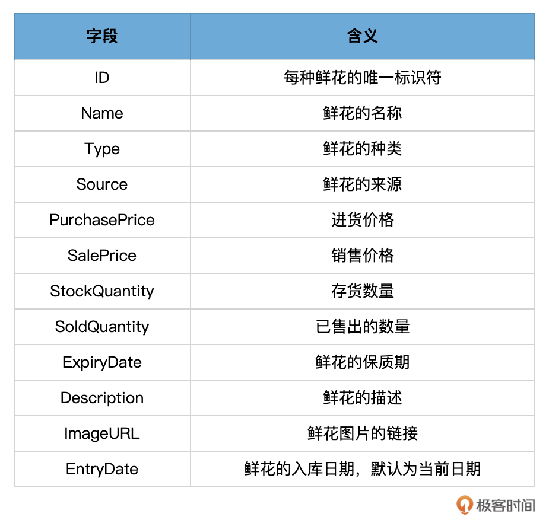
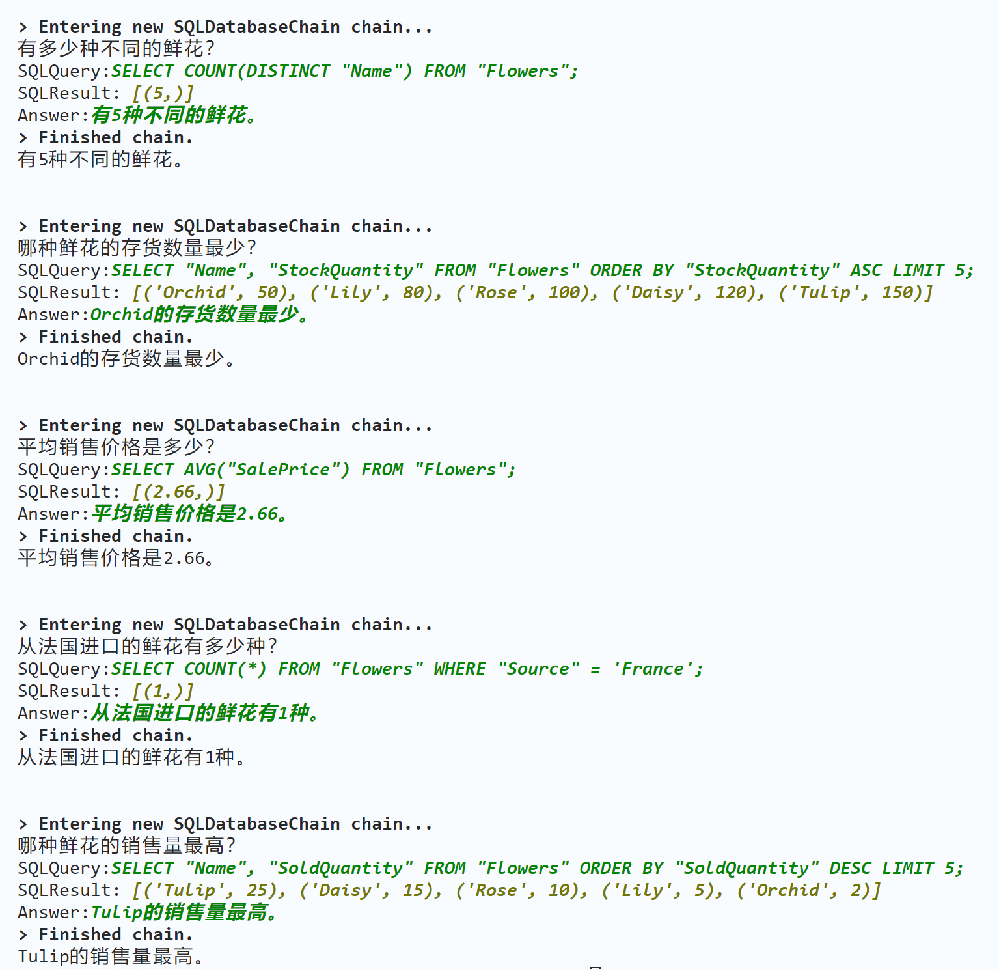

# 16｜连接数据库：通过链和代理查询鲜花信息
你好，我是黄佳，欢迎来到 LangChain 实战课！

一直以来，在计算机编程和数据库管理领域，所有的操作都需要通过严格、专业且结构化的语法来完成。这就是结构化查询语言（SQL）。当你想从一个数据库中提取信息或进行某种操作时，你需要使用这种特定的语言明确地告诉计算机你的要求。这不仅需要我们深入了解正在使用的技术，还需要对所操作的数据有充分的了解。


你需要拥有一个程序员基本的技能和知识才能有效地与计算机交互。不过，随着人工智能的兴起和大语言模型的发展，情况开始发生变化。

现在，我们正进入一个 **全新的编程范式**，其中机器学习和自然语言处理技术使得与计算机的交互变得更加自然。这意味着，我们可以用更加接近我们日常话语的自然语言来与计算机交流。例如，不用复杂的SQL语句查询数据库，我们可以简单地问：“请告诉我去年的销售额是多少？” 计算机能够理解这个问题，并给出相应的答案。

这种转变不仅使得非技术人员更容易与计算机交互，还为开发者提供了更大的便利性。简而言之，我们从“ **告诉计算机每一步怎么做**”，转变为“ **告诉计算机我们想要什么**”，整个过程变得更加人性化和高效。

## 新的数据库查询范式

下面这个图，非常清晰地解释了这个以LLM为驱动引擎，从自然语言的（模糊）询问，到自然语言的查询结果输出的流程。


这种范式结合了自然语言处理和传统数据库查询的功能，为用户提供了一个更为直观和高效的交互方式。下面我来解释下这个过程。

1. 提出问题：用户用自然语言提出一个问题，例如“去年的总销售额是多少？”。
2. LLM理解并转译：LLM首先会解析这个问题，理解其背后的意图和所需的信息。接着，模型会根据解析的内容，生成相应的SQL查询语句，例如 “SELECT SUM(sales) FROM sales\_data WHERE year = ‘last\_year’;”。
3. 执行SQL查询：生成的SQL查询语句会被发送到相应的数据库进行执行。数据库处理这个查询，并返回所需的数据结果。
4. LLM接收并解释结果：当数据库返回查询结果后，LLM会接收到这些数据。然后，LLM会开始解析这些数据，并将其转化为更容易被人类理解的答案格式。
5. 提供答案：最后，LLM将结果转化为自然语言答案，并返回给用户。例如“去年的总销售额为1,000,000元”。

你看，用户不需要知道数据库的结构，也不需要具备编写SQL的技能。他们只需要用自然语言提问，然后就可以得到他们所需的答案。这大大简化了与数据库的交互过程，并为各种应用场景提供了巨大的潜力。

## 实战案例背景信息

下面我们将通过LangChain实现这个新的数据库应用开发范式。

在这个实战案例中，我们的所有业务数据都存储在数据库中，而目标则是通过自然语言来为销售的每一种鲜花数据创建各种查询。这样，无论是员工还是顾客，当他们想了解某种鲜花的价格时，都可以快速地生成适当的查询语句。

**这就大大简化了查询过程和难度。**

首先，这个应用可以被简单地用作一个查询工具，允许员工在存货或销售系统中快速查找价格。员工不再需要记住复杂的查询语句或进行手动搜索，只需选择鲜花种类，告诉系统他所想要的东西，系统就会为他们生成正确的查询。

其次，这个模板也可以被整合到一个聊天机器人或客服机器人中。顾客可以直接向机器人询问：“红玫瑰的价格是多少？” 机器人会根据输入内容来调用LangChain和LLM，生成适当的查询，然后返回确切的价格给顾客。这样，不仅提高了服务效率，还增强了用户体验。

了解完项目的背景信息，下面我们就开始行动吧！

## 创建数据库表

首先，让我们创建一系列的数据库表，存储易速鲜花的业务数据。

这里，我们使用SQLite作为我们的示例数据库。它提供了轻量级的磁盘文件数据库，并不需要单独的服务器进程或系统，应用程序可以直接与数据库文件交互。同时，它也不需要配置、安装或管理，非常适合桌面应用、嵌入式应用或初创企业的简单需求。

SQLite支持ACID（原子性、一致性、隔离性、持久性），这意味着你的数据库操作即使在系统崩溃或电源失败的情况下也是安全的。虽然SQLite被认为是轻量级的，但它支持大多数SQL的标准特性，包括事务、触发器和视图。

因此，它也特别适用于那些不需要大型数据库系统带来的全部功能，但仍然需要数据持久性的应用程序，如移动应用或小型Web应用。当然，也非常适合我们做Demo。

sqlite3库，则是Python内置的轻量级SQLite数据库。通过sqlite3库，Python为开发者提供了一个简单、直接的方式来创建、查询和管理SQLite数据库。当你安装Python时，sqlite3模块已经包含在内，无需再进行额外的安装。

基于这个sqlite3库，创建业务数据的代码如下：

```plain
# 导入sqlite3库
import sqlite3

# 连接到数据库
conn = sqlite3.connect('FlowerShop.db')
cursor = conn.cursor()

# 执行SQL命令来创建Flowers表
cursor.execute('''
        CREATE TABLE Flowers (
            ID INTEGER PRIMARY KEY,
            Name TEXT NOT NULL,
            Type TEXT NOT NULL,
            Source TEXT NOT NULL,
            PurchasePrice REAL,
            SalePrice REAL,
            StockQuantity INTEGER,
            SoldQuantity INTEGER,
            ExpiryDate DATE,
            Description TEXT,
            EntryDate DATE DEFAULT CURRENT_DATE
        );
    ''')

# 插入5种鲜花的数据
flowers = [
    ('Rose', 'Flower', 'France', 1.2, 2.5, 100, 10, '2023-12-31', 'A beautiful red rose'),
    ('Tulip', 'Flower', 'Netherlands', 0.8, 2.0, 150, 25, '2023-12-31', 'A colorful tulip'),
    ('Lily', 'Flower', 'China', 1.5, 3.0, 80, 5, '2023-12-31', 'An elegant white lily'),
    ('Daisy', 'Flower', 'USA', 0.7, 1.8, 120, 15, '2023-12-31', 'A cheerful daisy flower'),
    ('Orchid', 'Flower', 'Brazil', 2.0, 4.0, 50, 2, '2023-12-31', 'A delicate purple orchid')
]

for flower in flowers:
    cursor.execute('''
        INSERT INTO Flowers (Name, Type, Source, PurchasePrice, SalePrice, StockQuantity, SoldQuantity, ExpiryDate, Description)
        VALUES (?, ?, ?, ?, ?, ?, ?, ?, ?);
    ''', flower)

# 提交更改
conn.commit()

# 关闭数据库连接
conn.close()

```

首先，我们连接到FlowerShop.db数据库。然后，我们创建一个名为Flowers的新表，此表将存储与每种鲜花相关的各种数据。

该表有以下字段：



接着，我们创建了一个名为flowers的列表，其中包含5种鲜花的所有相关数据。使用for循环，我们遍历flowers列表，并将每种鲜花的数据插入到Flowers表中。然后提交这些更改，把它们保存到数据库中。最后，我们关闭与数据库的连接。

## 用 Chain 查询数据库

因为LangChain的数据库查询功能较新，目前还处于实验阶段，因此，需要先安装langchain-experimental包，这个包含有实验性的LangChain新功能。

```plain
pip install langchain-experimental

```

下面，我们就开始通过SQLDatabaseChain来查询数据库。代码如下：

```plain
# 导入langchain的实用工具和相关的模块
from langchain.utilities import SQLDatabase
from langchain.llms import OpenAI
from langchain_experimental.sql import SQLDatabaseChain

# 连接到FlowerShop数据库（之前我们使用的是Chinook.db）
db = SQLDatabase.from_uri("sqlite:///FlowerShop.db")

# 创建OpenAI的低级语言模型（LLM）实例，这里我们设置温度为0，意味着模型输出会更加确定性
llm = OpenAI(temperature=0, verbose=True)

# 创建SQL数据库链实例，它允许我们使用LLM来查询SQL数据库
db_chain = SQLDatabaseChain.from_llm(llm, db, verbose=True)

# 运行与鲜花运营相关的问题
response = db_chain.run("有多少种不同的鲜花？")
print(response)

response = db_chain.run("哪种鲜花的存货数量最少？")
print(response)

response = db_chain.run("平均销售价格是多少？")
print(response)

response = db_chain.run("从法国进口的鲜花有多少种？")
print(response)

response = db_chain.run("哪种鲜花的销售量最高？")
print(response)

```

这里，我们导入必要的LangChain模块，然后连接到FlowerShop数据库，初始化OpenAI的LLM实例。之后用SQLDatabaseChain来创建一个从LLM到数据库的链接。

最后，用db\_chain.run()方法来查询多个与鲜花运营相关的问题，Chain的内部会把这些自然语言转换为SQL语句，并查询数据库表，得到查询结果之后，又通过LLM把这个结果转换成自然语言。

因此，Chain的输出结果是我们可以理解的，也是可以直接传递给Chatbot的人话。

输出如下：



SQLDatabaseChain调用大语言模型，完美地完成了从自然语言（输入）到自然语言（输出）的新型SQL查询。

## 用 Agent 查询数据库

除了通过Chain完成数据库查询之外，LangChain 还可以通过SQL Agent来完成查询任务。相比SQLDatabaseChain，使用 SQL 代理有一些优点。

- 它可以根据数据库的架构以及数据库的内容回答问题（例如它会检索特定表的描述）。
- 它具有纠错能力，当执行生成的查询遇到错误时，它能够捕获该错误，然后正确地重新生成并执行新的查询。

LangChain使用create\_sql\_agent函数来初始化代理，通过这个函数创建的SQL代理包含SQLDatabaseToolkit，这个工具箱中包含以下工具：

- 创建并执行查询
- 检查查询语法
- 检索数据表的描述

在这些工具的辅助之下，代理可以趋动LLM完成SQL查询任务。代码如下：

```plain
from langchain.utilities import SQLDatabase
from langchain.llms import OpenAI
from langchain.agents import create_sql_agent
from langchain.agents.agent_toolkits import SQLDatabaseToolkit
from langchain.agents.agent_types import AgentType

# 连接到FlowerShop数据库
db = SQLDatabase.from_uri("sqlite:///FlowerShop.db")
llm = OpenAI(temperature=0, verbose=True)

# 创建SQL Agent
agent_executor = create_sql_agent(
    llm=llm,
    toolkit=SQLDatabaseToolkit(db=db, llm=llm),
    verbose=True,
    agent_type=AgentType.ZERO_SHOT_REACT_DESCRIPTION,
)

# 使用Agent执行SQL查询

questions = [
    "哪种鲜花的存货数量最少？",
    "平均销售价格是多少？",
]

for question in questions:
    response = agent_executor.run(question)
    print(response)

```

问题1的输出如下：


问题2的输出如下：


可以看到，和Chain直接生成SQL语句不同，代理会使用 ReAct 风格的提示。首先，它思考之后，将先确定第一个action是使用工具 sql\_db\_list\_tables，然后观察该工具所返回的表格，思考后再确定下一个 action是sql\_db\_schema，也就是创建SQL语句，逐层前进，直到得到答案。

## 总结时刻

今天的内容很容易理解，又很开脑洞。我最想强调的，仍然是从“告诉计算机要做什么”的编程范式向“告诉计算机我们想要什么”的范式的转变。

这种转变具有深远的意义。

1. 更大的可达性：不再需要深入的技术知识或特定的编程背景。这意味着非技术人员，比如业务分析师、项目经理甚至是终端用户，都可以直接与数据交互。
2. 高效率与生产力：传统的编程方法需要大量的时间和努力，尤其是在复杂的数据操作中。自然语言处理和理解能够显著减少这种负担，使得复杂的数据操作变得更加直观。
3. 错误的减少：许多编程错误源于对特定语法或结构的误解，通过使用自然语言，这些源于误解的错误将大大减少。
4. 人与机器的紧密结合：在这种新范式下，机器更像是人类的合作伙伴，而不仅仅是一个工具。它们可以理解我们的需求，并为我们提供解决方案，而无需我们明确指导每一步。

但这种转变也带来了挑战。

1. 模糊性的问题：自然语言本身是模糊的，机器必须能够准确地解释这种模糊性，并在必要时寻求澄清。
2. 对现有系统的依赖：虽然自然语言查询看起来很有吸引力，但许多现有系统可能不支持或不兼容这种新范式。
3. 过度依赖：如果过于依赖机器为我们做决策，那么我们可能会失去对数据的深入了解和对结果的质疑。

我们正处于一个技术变革的时刻，自然语言与编程之间的界限正在消失。对于那些愿意接受和采纳这种新范式的人来说，未来充满了无限的可能性。

## 思考题

1. LangChain中用Chain和Agent来查询数据库，这两种方式有什么异同？
2. 你能否深入上面这两种方法的代码，看一看它们的底层实现。尤其是要看LangChain是如何做提示工程，指导模型生成 SQL 代码的。

期待在留言区看到你的分享，如果你觉得内容对你有帮助，也欢迎分享给有需要的朋友！最后如果你学有余力，可以进一步学习下面的延伸阅读。

## 延伸阅读

1. 文档：LangChain中关于数据库接口的 [官方文档](https://python.langchain.com/docs/modules/chains/popular/sqlite)
2. 工具：上面的文档中提到了 [LangSmith](https://docs.smith.langchain.com/) 工具，用于调试、测试和评估LangChain开发的LLM应用程序